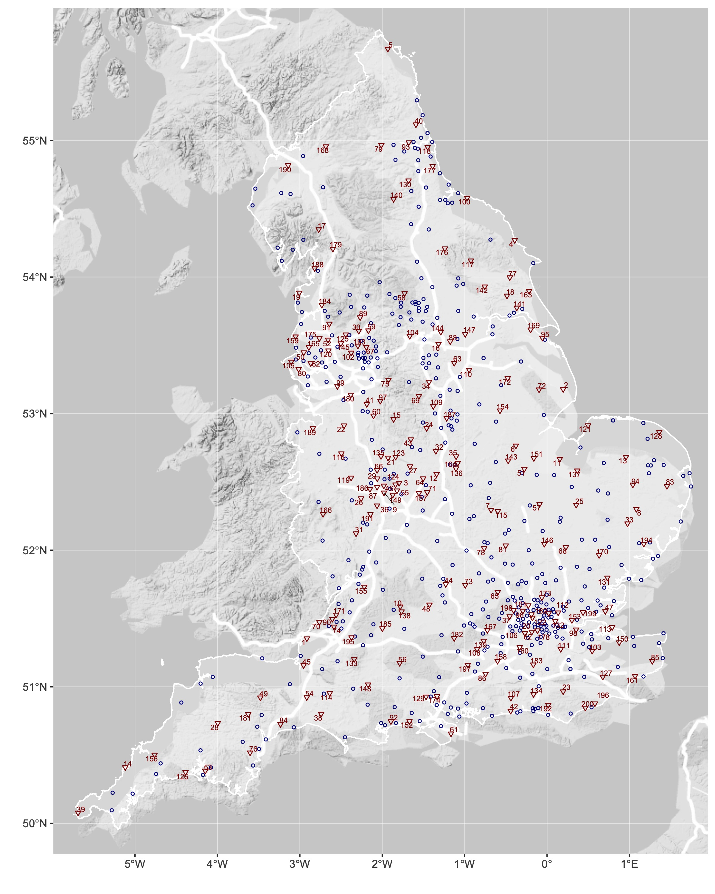
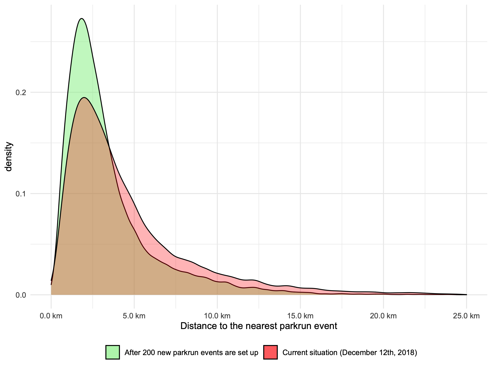

---
output:
  output: pdf_document
bibliography: bibliography.bib
csl: vancouver.csl
---


# Multiple deprivation and geographic distance to community sport events — achieving equitable access to parkrun in England 

  Schneider PP$^{*,1}$, Smith RA$^{1}$, Bullas AM$^{2}$, Quirk H$^{2}$, Bayley T$^{1}$, Haake SSJ$^{2}$, Brennan A$^{1}$, Goyder E$^{1}$ 


*$^{1}$School of Health and Related Research, University of Sheffield, Sheffield, UK.;    
$^{2}$Advanced Wellbeing Research Centre, Sheffield Hallam University, Sheffield, UK.*

Corresponding author: Paul Schneider (p.schneider@sheffield.ac.uk)

Target Journal: 1) Public Health (https://www.journals.elsevier.com/public-health), 2) BMJ Open, 3) Wellcome Open Research

\newpage

## Abstract

### Objectives 

To evaluate geographical access to parkrun in England, and to identify 200 locations for future events to maximize geographic access to parkrun.

### Study design 

This study is a cross-sectional ecological analysis of the socio-economic disparities in geographic access to parkrun events in England at the end of 2018.

### Methods 

We combined geo-location data on all English Lower Layer Super Output Areas and parkrun events to calculate geodesic distances to the nearest event for over 32,000 communities in England. We use this measure of geographic access to summarise the relationship between access and socio-economic deprivation, measured using the Index of Multiple Deprivation. We then used geographic coordinates of public green spaces in England to conduct a simple location-allocation analysis to identify 200 locations for future parkrun events that would maximize access.


### Results 

Geographical access to parkrun in England is good, over two thirds of the population live within 5km of a parkrun. It is also very equitable, access is slightly better in more deprived communities. Optimally locating an additional 200 events would improve access considerably, approximately 82% of the English population would be within 5km of a parkrun event. 

### Conclusions

Access to parkrun is good, and equitable. Creating new parkrun events will improve geographic access to parkrun, but a deeper understanding of the barriers to participation in deprived communities is necessary in order to develop effective strategies to improve engagement.

\newpage


## Introduction

Insufficient physical activity is one of the leading causes of disease and disability worldwide.[@who2009] In the UK, around one in six deaths is attributable to low levels of physical activity.[@lee2012] It is also a major contributor to health inequalities, as people from low socio-economic backgrounds are both disproportionately likely to be inactive [@rowe2000sport; @farrell2014] and be affected by physical inactivity-related diseases [@petrovic2018contribution]. Increasing the physical activity levels of the population is therefore high on the public health agenda: it not only has the potential to improve quality of life, reduce mortality rates and alleviate the strain on health and social care services, but also reduce the gap in health inequalities [@vilhelmsson2018]. 

However, designing effective public health interventions that increase population physical activity is considerable challenge.[@reis2016] Implementing such interventions in a way that does not increase health inequalities might even be more difficult, as studies have shown that programmes to increase physical activity often fail to reach deprived communities and those most in need.[@white2009; @rideout2018]

parkrun, an international movement which organises free weekly 5km running events, might provide valuable lessons for public health professionals with respect to both. Since its founding in 2004, as a small event in London with 13 participants, it has grown to become one of the world's largest mass sporting events, with up to 360,000 participants in more than 20 countries.[@haake2018pr; @reece2019] The volunteer-led running events are often characterised as accessible and inclusive.[@stevinson2013] The organisation has been widely praised as being successful in encouraging participation particularly in individuals who were previously inactive.[@stevinson2019changes; @wiltshire2018] 

Notwithstanding these subjective accounts, the expansion of parkrun in England, as elsewhere, has been largely grassroots, driven by *demand* rather than *need*. It might therefore be the case that parkrun events are primarily located in areas that are relatively affluent, while people living in more deprived communities may not have the same opportunities to participate. In 2019, Sport England announced funding to support the creation of 200 new parkrun events across England within three years, with the specific aim of increasing participation of individuals from lower socio-economic groups.[@reuters2018] 

The aims of this study are two-fold: firstly, to evaluate whether geographic access to parkrun events in England geographic access to parkrun events in England is equitable across areas with different levels of deprivation. Secondly, to identify 200 optimal locations for future events in order to improve geographic access, in particular for deprived communities.


## Methods

### Study design

This study is a cross-sectional ecological analysis of the socio-economic disparities in geographic access to parkrun events in England at the end of 2018. All analyses were conducted on the level of Lower Layer Super Output Areas (LSOAs), which divide England into 32,844 geographic units which, on average, have a population of approximately 1,700. We assessed the relationship between access, defined as the distance (as the crow flies) to the nearest parkrun event, and socio-economic deprivation, measured using the Index of Multiple Deprivation. In addition, we used information on public green spaces in England to conduct a simple location-allocation analysis, in order to identify 200 locations for future parkrun events that maximise access for the population.


### Data sources

  For this study, we combined data on three types of geospatial entities: 1) LSOAs, 2) parkrun events, and 3) public green spaces.

  1) For all 32,844 LSOAs, we retrieved geographic locations, defined by the coordinates of its population-weighted centroid, 2017 total population estimates, and the 2015 Index of Multiple Deprivation (IMD) from the Office for National Statistics.[@ons2011; @ons2015; ons2017] 

  2) We included all 465 public parkrun events which were in operation in England by December 12th, 2018 - on this date, Sport England announced their plan to provide funding for setting up 200 additional parkrun events across England.[@parkrunGroup] The locations of the events were manually scrapped from the parkrun UK website.[@parkrunweb]

  3) The locations of public green spaces in England were retrieved from an open dataset of Ordnance Survey.[@ordnance] parkrun events are held in various settings and terrains, and do not always require a single 5km loop - some events have courses that involve running back and forth. After evaluating existing parkrun event courses, we decided to consider all public parks, gardens, and playing fields in England with an area of 0.1 km$^2$ or more potentially suitable for hosting events (n=2,842). 


### Variables

  The two variables of interest were access to parkrun events and deprivation of LSOAs.

  Access to parkrun was measured in terms of the distance as the crow flies (in km) to the nearest event. For each of the 32,844 LSOAs, we computed the geodesic distances between its population-weighted centroid and all 465 parkun events that were in operation on December 12th, 2018, and then selected the shortest distance.

  The socio-economic deprivation of LSOAs was measured using the 2015 IMD. It is a measure of relative deprivation, which has been used in many similar studies. The IMD combines 37 indicators from seven domains (income, employment, education and skills, health and disability, crime, housing and services, and living environment) into a single score. The score ranges from 0 (least deprived) to 100 (most deprived).[@smith2015] 

  Other covariates, which are likely to affect the availability of parkrun events within an area (e.g. population density or demographics), were not taken into account, because we did not aim to assess to what extent deprivation independently 'explained' access. Rather, we sought to evaluate whether or not people living in deprived areas have better or worse access, given the actual circumstances.


### Analysis

  Mean, standard deviation, median, interquartile range, and range were used as descriptive statistics. We then assessed the association between the IMD and the distance to the nearest parkrun event on the LSOA level. Our hypothesis was that more deprived areas had worse access, i.e. longer distances to the nearest parkrun event than more affluent areas. Pearson and Spearman correlation coefficients were computed using the LSOAs' total population as weights. We also conducted a stratified analysis, for which we grouped LSOAs into IMD quintiles (most, more, median, less, least deprived) and assessed access to parkrun events in each strata.

#### Identifying optimal locations for new parkrun events

  We conducted a location-allocation analysis to solve the following problem: parkrun UK received funding to start 200 additional parkrun events. There are 2,842 public green spaces in England in which new events could be set up. Which 200 locations should be selected, in order to maximise access for the greatest number of people?

  More specifically, the objective was to minimise the population-weighted total sum of distances between all LSOAs and their nearest parkrun event. To identify the optimal 200 green spaces, we applied a simple greedy algorithm that consisted of two steps. Firstly, for each green space, we evaluate how setting up a parkrun event would affect the sum of distances, given the locations of all existing events (i.e. for how many LSOAs would this green space then be the nearest parkrun event, and by how much would it decrease the respective distances). Secondly, the green space with the greatest effect is selected and added to the set of existing parkrun events. This procedure is repeated 200 times.

\bigskip

  More formally, the first step of the algorithm is defined by the following equation:

$$\underset{c\in C}{\operatorname{arg min}}\sum_{i=1}^{32,844}{ d_i(E \cap c) * p_{i}}$$

  The function yields the candidate green space $c$, from the set of all 2,842 green spaces $C$, which minimises the sum of the population-weighted distances between LSOAs and their nearest parkrun event. The total population of LSOA $i$ is denoted $p_i$, and $d_i(E \cap c)$ denotes LSOA $i$'s distance to the nearest parkrun event, which can either be an existing event from the set of 465 parkrun events, denoted $E$, or the candidate green space $c$, whichever is nearest.  

  In order to identify the optimal new locations for setting up 200 new parkrun events consecutively, the selection procedure is repeated 200 times. At each step, the single best candidate green space location is selected, added to the set of established parkrun events $E$, and removed from the set of available green spaces $C$. This means, the effect of the green space selected at step $k$ is taken into account when selecting the $k$th+1 location.

  We assessed the overall impact of setting up 200 new parkrun events on the geographic access to parkrun events in England. We also investigated the effects on LSOAs across IMD quintiles in a  distributional analysis.


### Data and source code availability

  All data and the R source code that were used to generate the results of this study are provided on an open repository.[@githubrepo]


### Ethical approval
  
  Ethical approval was obtained from the Sheffield Hallam University Ethics Committee (ER10776545). We did not collect any personal information, but only used aggregate secondary data. The parkrun Research Board approved this research project, and four of its members (AMB, HQ, EG, SSJH) were actively involved in the interpretation of findings and writing of this manuscript.

## Results

### Descriptive statistics

  As of 12th December 2018, approximately 7%, 69%, and 91% of the English population lived within 1, 5, and 10km distance of a parkrun event. Only 578,043 people (1% of the English population) lived more than 20km from an event. The average (SD) and median (IQR) distance to the nearest parkrun event were 4.65 (4.22) and 3.39 (1.99-5.83). The worst access was observed for 2,259 people living on the Isles of Scilly, who live about 76.44km (as the crow flies) away from the next parkrun event on the mainland. Further descriptive statistics are provided in table 1.

```{r echo=FALSE, message=FALSE, warning=FALSE}
load(file = "./output/desc_tbls.RDS")
library(knitr)
library(kableExtra)


kable(rbind(desc_tbl1,desc_tbl2),format.args = list(big.mark=","),
      caption = "Descriptive statistics of LSOAs and parkrun events",
      format = "latex",
      # longtable = T, 
      booktabs = T) %>%
  group_rows(group_label = "LSOAs (n = 32,844)",
             start_row = 1,hline_before=F,
             end_row = 3) %>%
   group_rows(group_label = "Parkrun events (n = 465)",
             start_row = 4,hline_before=T,
             end_row = 5) %>%
  add_footnote("Number of LSOAs/total population for which a given parkrun event is the nearest.",notation = "symbol")
```


### Association between deprivation and access

There was a negative relationship between IMD and the distance to the nearest parkrun event: the (population weighted) Pearson and Spearman correlation coefficients were -0.15 and -0.18, indicating a small negative correlation. This means that more deprived LSOAs tended to have shorter distances to the nearest parkrun event, i.e. better geographical access. 

The distributional analysis of distances by IMD quintile showed that people living in the 20% most deprived LSOAs  had the best geographic access, with an average and median distance to the nearest parkrun event of 3.51 and 2.79 km. Depending on the metric, the worst access was observed for LSOAs in the middle (mean distance = 3.36km) or the less deprived group (median distance = 3.93km). Further results of the distributional analysis are shown in Table 2 in the following section. 


### Optimal locations for new parkrun events

Figure 1 shows the parkrun events (black circles) that existed on 12th December 2018 alongside recommendations for 200 additional event locations (red triangles), which maximise overall access to parkrun for the greatest number of people. The numbers correspond to the rank, where 1 is the location which would improve access the most. The names and exact locations of the selected 200 green spaces are provided in the appendix.



**Figure 1: Map of England showing current parkrun events (blue circles) and recommended new event locations (red triangles) ranked in descending order of estimated effect on overall population-weighted access. Information on all 200 identified optimal green space locations are provided in the appendix.**

We estimated that setting up new parkrun events in those 200 green spaces would improve access for around 16.5 million people (30% of the population) from 9,854 LSOAs. For these people, the distance to the nearest event would, on average, be reduced by 4.09 km (SD = 3.97). Overall, it would reduce the average and median distance to the nearest parkrun event from 4.65 and 3.39 km to 3.43 and 2.59 km. The percentage of people who live within 5km of a parkrun would increase from 69% to 82%. Figure 2 shows the distribution of distances between LSOAs and their nearest parkrun events before and after the introduction of the 200 new optimal event locations at the identified optimal green spaces. 



**Figure 2: Density plot showing the distance, as the crow flies, to parkrun events before and after the creation of 200 new events in identified green-spaces. **


Table 2 shows further results for the effects on LSOAs across IMD quintiles. Overall, setting up 200 new events in the recommended green spaces would amplify the negative association between IMD and geographic access: the population-weighted Pearson and Spearman correlation coefficients changed from -0.15 and -0.18 before, to -0.20 and -0.23 afterwards, indicating that improvements in access to parkrun events were greater for more deprived LSOAs as compared to less deprived LSOAs. Nevertheless, the distributional analysis showed that the improvement in access was smallest for LSOAs in the most deprived quintile.

```{r echo=FALSE, message=FALSE, warning=FALSE}
load(file = "./output/distr.res.RDS")
library(knitr)
library(kableExtra)

kable(distr.res,
      caption = "Distributional analysis. The table shows the access to parkrun events before and after 200 new parkrun events are set up at optimal green spaces, stratified by IMD quintiles",
      format = "latex",
      # longtable = T, 
      booktabs = T) %>%
  kableExtra::add_header_above(header = c(" "=1,"Current situation (December 12th, 2018)"=3,"After 200 new parkrun events are set up"=3)) %>%
  kableExtra::kable_styling(latex_options = "scale_down") %>%
  kableExtra::row_spec(row = 5,hline_after = T)
```


## Discussion

  Overall, geographic access to parkrun in England is good: in December 2018 the median distance to the nearest parkrun event was 3.39 km and more than two thirds of the population lived within 5km (the parkrun distance) of a parkrun event. Contrary to our expectation, we did not find that access was better for people living in more affluent areas. In fact, those living in the most deprived areas had the best geographic access to parkrun. It is rare in public health for inequalities to exist in this direction.

  Our analysis has shown that setting up 200 new events in the recommended (optimal) green spaces in England would considerably improve access - for example, the percentage of English residents who live within 5km of a parkrun would increase to 82%. Moreover, the recommended expansion of parkrun would improve the geographic access for the most deprived communities more than the access of those living in more affluent areas. 

  The main finding, that geographical access to parkrun events is better in more deprived communities, is surprising. parkrun events are set up by volunteers, based on demand, not need. Studies have shown that the level of physical activity, and the availability of physical activity facilities generally declines with the level of deprivation.[@farrell2014socioeconomic] Opportunities for physical activity are often lacking in areas in most need.[e.g. @hillsdon2007] parkrun events, in contrast, seem to be often held in or near deprived areas, and are free to attend, giving anyone equal access, irrespective of their socio-economic background. Nevertheless, in a previous analysis, we found that participation in parkrun has a strong socioeconomic gradient with considerably higher participation rates in more affluent areas: about a third of all participants came from LSOAs in the least deprived quintile, while only 7% came from the most deprived quintile.[@smithschneider; @schneidersmith] This suggests that providing the opportunity to participate in parkrun events, while a necessary first step to enable participation, has not been sufficient to engage deprived communities.[@white2009]

  There are several strengths of this study that deserve mention. Firstly, it is the first study of geographic access to parkrun in England - therefore the approach is novel and the data untapped. Secondly the analysis makes use of large and rich datasets, with over 30,000 LSOA and over 400 existing parkrun events it is unlikely that individual outliers are affecting the results. 

  However, there are also limitations. Most importantly geographic access is not measured as travel distance, or travel time. In some cases, for example where natural barriers like lakes or rivers block routes, the actual distance travelled may be far in excess of the distance as the crow flies.[@boscoe2012] 

  Furthermore, the list of green spaces that we considered as potential sites for future parkrun events is neither comprehensive nor without limitations. Not all included green spaces may be suitable to host events (e.g. because of the terrain or the setting), and the list also does not contain all suitable places (e.g. many blue spaces such as beaches and promenades are not included). 

  Finally. our analysis has been concerned only with determining to what extent deprived communities have geographic access to parkrun events. We did not investigate what other factors independently explain access more generally. It should be noted, however, that a contributing factor for the negative relationship between IMD and access is likely to be population density: deprived areas cluster in urban areas, where also most parkrun events take place. Rural areas, on the other hand, may therefore have worse geographical access as the crow flies. Further studies are required to better understand wider determinants of access to parkrun and/or physical activity facilities more generally.

  In England, parkrun has been hugely successful in engaging large numbers of people in physical activity.[@reece2019] The inclusive culture of their events, and the almost universal availability of parkrun events throughout the country provide a learning opportunity to explore socio-spatial determinants influencing physical activity behaviour on a national scale.[@wiltshire2018] Our study contributes to the limited research in this area and identifies possible leads for further investigations. Studying barriers to participation in parkrun, other than geographic access, is likely to improve our understanding of the reasons why physical activity levels are lower in more deprived areas and may help to design more effective public health interventions to increase levels of physical activity in the population. Future research should build on this work and develop a model to assess the (cost-)effectiveness of setting up new events, and other strategies, not only in terms of improved potential access, but actual participation. This requires estimating the causal and marginal effects of different interventions on participation, and therefore physical activity levels, using longitudinal data and sophisticated modelling techniques. 

## Conclusion

  In England, geographic access to parkrun events is good, and can be further improved with the creation of 200 new events. Contrary to our expectation, we find that geographic access is better for those living in more deprived communities. Given that participation rates are generally lower in deprived areas, improving access alone is unlikely to significantly reduce inequalities in participation and/or levels of physical activity. A deeper understanding is needed of the barriers to participation in deprived communities if effective strategies are going to be created to improve engagement.

## Additional Information

### Grant Information
P.S, R.S & T.B are joint funded by the Wellcome Trust Doctoral Training Centre in Public Health Economics and Decision Science [108903] and the University of Sheffield.

### Competing Interests
P.S, R.S, T.B & A.Br have no competing interests.
S.H. is chair, A.Bu. and H.Q are deputy chairs, and E.G. is a member of the parkrun research board.

### Software & Data Availability
All data and source code are available at: TBC (<add final GitHub repo>).

### Author contributions

Paul Schneider; Roles: Conceptualization, Data Curation, Formal Analysis, Investigation, Methodology, Project Administration, Software, Visualization, Writing – Original Draft Preparation, Writing – Review & Editing

Robert Smith; Roles: Conceptualization, Data Curation, Formal Analysis, Investigation, Methodology, Project Administration, Software, Visualization, Writing – Original Draft Preparation, Writing – Review & Editing

Alice Bullas; Roles: Writing – Review & Editing

Steve Haake; Writing – Review & Editing

Helen Quirk; Roles: Writing – Review & Editing

Thomas Bayley; Roles:  Methodology

Alan Brennan; Roles: Supervision, Methodology, Writing – Review & Editing

Elizabeth Goyder; Roles: Supervision, Conceptualization, Writing – Review & Editing


\newpage

## References

<div id="refs"></div>

\newpage

## Appendix

```{r echo=FALSE}
  kable(read.csv("./output/map_legend.csv"),
        caption = "List of all 200 recommended green spaces for setting up parkrun events to maximise geographic access.",
        format = "latex",align = "lcccccc",
        col.names = linebreak(c("Park name",
                                "Total wtd. average distance",
                                "% Change from previous step",
                                "Park area (km2)",
                                "Longitude",
                                "Lattitude")),
        longtable = T, 
        booktabs = T) %>%
  kable_styling(font_size = 7,full_width = F) %>%
  column_spec(1, width = "3cm") %>%
  column_spec(2:4, width = "1cm") %>%
  column_spec(5:6, width = "1cm") 
```


