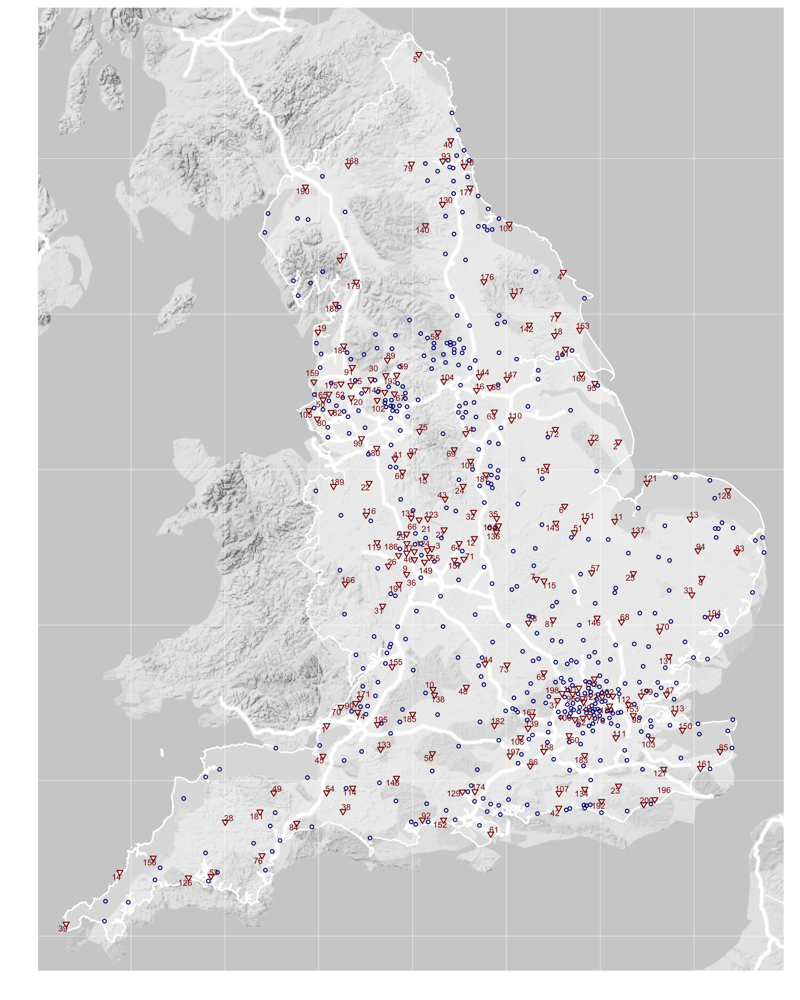

---
output:
  output: pdf_document
bibliography: bibliography.bib
csl: vancouver.csl
---


# Multiple deprivation and geographic distance to community sport events — achieving equitable access to parkrun in England 

  Schneider PP$^{*,1}$, Smith RA$^{1}$, Bullas AM$^{2}$, Quirk H$^{2}$, Bayley T$^{1}$, Haake SSJ$^{2}$, Brennan A$^{1}$, Goyder E$^{1}$ 


*$^{1}$School of Health and Related Research, University of Sheffield, Sheffield, UK.; $^{2}$Advanced Wellbeing Research Centre, Sheffield Hallam University, Sheffield, UK.*


## Introduction

Insufficient physical activity is a leading cause of disease and disability worldwide.[@who2009] For the UK, around one in six deaths is attributable to low levels of physical activity.[@lee2012] It is also a major contributor to health inequalities, as people from low socio-economic background are disproportionately affected by physical inactivity-related diseases. Increasing the physical activity levels of the population is therefore high on the public health agenda: it not only has the potential to improve quality of life, reduce mortality rates and alleviate the strain on health and social care services, but also reduce the gap in health inequalities. 

However, designing effective public health interventions that increase population physical activity is considerable challenge.[@ref] Implementing such interventions in a way that does not increase health inequalities might even be more difficult, as studies have shown that programmes to increase physical activity often fail to reach deprived communities and those most in need.[@white2009; @rideout2018]

parkrun, an international movement which organises free weekly 5km running events, might provide valuable lessons for public health professional with respect to both. Since its founding as a small event in London with 13 participants in 2004, it has grown to become one of the world's largest mass sporting events, with up to 360,000 participants in more than 20 countries.[@ref] The volunteer-led running events are often characterised as accessible and inclusive.[@stevinson2015] The organisation has been widely praised as being successful in encouraging participation particularly in individuals who were previously inactive.[@stevinson2004; @wiltshire2018] 

Notwithstanding these subjective accounts, the expansion of parkrun in England, as elsewhere, has been largely driven by *demand*, not *need*. It might therefore be the case that parkrun events are primarily located in areas that are relatively well-off anyway, while people living in more deprived communities may not have the same opportunities to participate. In 2019, Sport England announced funding to support the creation of 200 new parkrun events across England within three years, with the specific aim of increasing participation of individuals from lower socio-economic groups.[@sportengland2018] 

The aims of this study are two-fold: firstly, to evaluate whether geographic access to parkrun events in England is equitable across areas with different levels of deprivation. Secondly, to identify 200 optimal locations for future events, in order to improve geographic access for deprived communities.


## Methods

### Study design

  This study is a cross-sectional ecological analysis of the socio-economic disparities in geographic access to parkrun events in England at the end of 2018. All analyses were conducted on the level of Lower Layer Super Output Areas (LSOAs), which divide England into 32,844 geographic units which, on average, have a population of approximately 1,700. We assessed the relationship between access, defined as the distance (as the crow flies) to the nearest parkrun event, and socio-economic deprivation, measured using the Index of Multiple Deprivation. In addition, we used information on public green spaces in England to conducted a simple location-allocation analysis, in order to identify 200 locations for future parkrun events, that maximise access for the population.


### Data sources

  For this study, we combined data on three types of geospatial entities: 1) LSOAs, 2) parkrun events, and 3) public green spaces.

  1) For all 32,844 LSOAs, we retrieved geographic locations, defined by the coordinates of its population-weighted centroid, 2017 total population estimates, and the 2015 Index of Multiple Deprivation (IMD) from the Office for National Statistics [@ons2018; @ref; @ref]. 

  2) We included all 465 public parkrun events which were in operation in England by December 12th, 2018 - on this date, Sport England announced their plan to provide funding for setting up 200 additional parkrun events across England.[@ref] The locations of the events were manually scrapped from the parkrun UK website.[@ref]

  3) The locations of public green spaces in England were retrieved from an open dataset of Ordnance Survey.[9] Even though parkrun events do not always require a 5km loop (some courses involve running back and forth) and are held in various settings and terrains, not all green spaces are suitable to host running events. After evaluating existing parkrun event courses, we decided to consider all public parks, gardens, and playing fields with an area of 0.1 km$^2$ (e.g. 316m x 316m) or more potentially suitable for hosting events (n=2,842). 


### Variables

  The two variables of interest were access to parkrun events and deprivation of LSOAs.

  Access to parkrun was measured in terms of the distance as the crow flies (in km) to the nearest event. For each of the 32,844 LSOAs, we computed the geodesic distances between its population-weighted centroid and all 465 parkun events that were in operation on December 12th, 2018, and then selected the shortest distance.

  The socio-economic deprivation of LSOAs was measured using the 2015 IMD. It is a measure of relative deprivation, which has been used in many similar studies. The IMD combines 37 indicators from seven domains (income, employment, education and skills, health and disability, crime, housing and services, and living environment) into a single score. The score ranges from 0 (least deprived) to 100 (most deprived).[@smith2015] 

  Other covariates, which are likely to affect the availability of parkrun events within an area (e.g. population density or demographics), were not taken into account, because we did not aim to assess to what extent deprivation independently 'explained' access. Rather, we sought to evaluate whether or not people living in deprived areas have better or worse access, given the actual circumstances.


### Analysis

  Mean, standard deviation, median, interquartile range, and range were used as descriptive statistics. We then assessed the association between the IMD and the distance to the nearest parkrun event on the LSOA level. Our hypothesis was that more deprived areas had worse access, i.e. longer distances to the nearest parkrun event than more affluent areas. Pearson and Spearman correlation coefficients were computed using the LSOAs' total population as weights. We also conducted a stratified analysis, for which we grouped LSOAs into IMD quintiles (most, more, median, less, least deprived) and assessed access to parkrun events in each strata.

#### Identifying optimal locations for new parkrun events

  We conducted a location-allocation analysis to solve the following problem: parkrun UK received funding to start 200 additional parkrun events. There are 2,842 public green spaces in England in which new events could be set up. Which 200 locations should be selected, in order to maximise access for the greatest number of people?

  More specifically, the objective was to minimise the population-weighted total sum of distances between all LSOAs and their nearest parkrun event. To identify the optimal 200 green spaces, we applied a simple greedy algorithm that consisted of two steps. Firstly, for each green space, we evaluate how setting up a parkrun event would affect the sum of distances, given the locations of all existing events (i.e. for how many LSOAs would this green space then be the nearest parkrun event, and by how much would it decrease the respective distances). Secondly, the green space with the greatest effect is selected and added to the set of existing parkrun events. This procedure is repeated 200 times.

\bigskip

  More formally, the first step of the algorithm is defined by the following equation:

$$\underset{c\in C}{\operatorname{arg min}}\sum_{i=1}^{32,844}{ d_i(E \cap c) * p_{i}}$$

  The function yields the candidate green space $c$, from the set of all 2,842 green spaces $C$, which minimises the sum of the products of the minimum distances and the total population of all LSOAs, whereby $p_i$ denotes the population of LSOA $i$, and $d_i(E \cap c)$ denotes the distance to the nearest parkrun event, which can either be an existing event from the set $E = \{e_{1},e_{2},...,e_{465}\}$, or the candidate green space $c$, whichever is nearest.  

  In order to identify the optimal 200 new locations for setting up new parkun events, the selection procedure is repeated 200 times. At each step, the single best candidate green space location is selected, added to the set of established parkrun events $E$, and removed from the set of available green spaces $C$. This means, the optimal green space selected at step $k$ is is taken into account when selecting the $k$th+1 location.


#### Evaluating the location allocation analysis

  We assessed the overall impact of setting up 200 new parkrun events at the identified optimal location on the geographic access to parkrun events in England. 
  In order to conduct a distributional analysis, we investigated the effect of setting up the 200 new events on LSOAs across IMD quintiles.


### Data and source code availability

  All data and the R source code that were used to generate the results of this study are provided on an open repository.[@ref]


### Ethical approval
  
  Ethical approval was obtained from the Sheffield Hallam University Ethics Committee (ER10776545). We did not collect any personal information, but only used aggregate secondary data. The parkrun Research Board approved this research project, and four of its members (AMB, HQ, EG, SSJH) were actively involved in the interpretation of findings and writing of this manuscript.

## Results

### Descriptive statistics

  As of 12th December 2018, approximately 7%, 69%, and 91% of the English population lived within 1, 5, and 10km distance of a parkrun event. Only 578,043 people (1% of the English population) lived more than 20km from an event. The average (SD) and median (IQR) distance to the nearest parkrun event were 4.65 (4.22) and 3.39 (1.99-5.83). The worst access was observed for 2,259 people living on the Isles of Scilly, who live about 76.44km (as the crow flies) away from the next parkrun event on the mainland. Further descriptive statistics are provided in table 1.

```{r echo=FALSE, message=FALSE, warning=FALSE}
load(file = "./output/desc_tbls.RDS")
library(knitr)
library(kableExtra)


kable(rbind(desc_tbl1,desc_tbl2),
      caption = "Table 1: Descriptive statistics of LSOAs and parkrun events",
      format = "latex",
      longtable = T, 
      booktabs = T) %>%
  group_rows(group_label = "LSOAs (n = 32,844)",
             start_row = 1,hline_before=F,
             end_row = 3) %>%
   group_rows(group_label = "Parkrun events (n = 465)",
             start_row = 4,hline_before=T,
             end_row = 5) %>%
  add_footnote("foot1")
   


```


### Association between Deprivation and Access

There was a negative relationship between IMD and the distance to the nearest parkrun event: the (population weighted) Pearson and Spearman correlation coefficients were -0.15 and -0.18, indicating a small effect. This means, more deprived LSOAs tended to have shorter distances to the nearest parkun event, i.e. better access. 

The distributional analysis of distances by IMD quintile showed that people living in the 20% most deprived LSOAs  had the best geographic access, with an average and median distance to the nearest parkrun event of 3.51 and 2.79 km. Depending on the metric, the worst access was observed for LSOAs in the middle (mean distance = 3.36km) or the less deprived group (median distance = 3.93km). Further results of the distributional analysis are shown in Table 2 in the following section. 


### Optimal locations for new parkrun events

Figure 1 shows the parkrun events (black circles) that existed on 12th December 2018 alongside recommendations for 200 additional event locations (red triangles), which maximise overall access to parkrun for the greatest number of people. The numbers correspond to the rank, where 1 is the location which would improve access the most. The names and exact locations of the selected 200 green spaces are provided in the appendix.



**Figure 1: Map of England showing current parkrun events (blue circles) and recommended new event locations (red triangles) ranked in descending order of estimated effect on overall population-weighted access. Information on all 200 identified optimal green space locations are provided in the appendix.**

We estimated that setting up new parkrun events in those 200 green spaces would improve access for around 16.5 million people (30% of th population) from 9,854 LSOAs. For those, the distance to the nearest event would, on average, be reduced by 4.09 km (SD = 3.97). The percentage of people who live within 5km of a parkrun would increase from 69% to 81.9%.

Table 2 shows the difference in geographic access before and after the introduction of the 200 new parkrun events at the identified optimal green spaces. Results are presented for the overall effect and stratified by IMD quintiles. The 200 new events amplified the relationship between IMD and geographic access further: the population-weighted Pearson and Spearman correlation coefficients changed from -0.15 and -0.18 before, to -0.20 and -0.23 afterwards. Nevertheless, the improvement in access was smallest for LSOAs in the most deprived quintile.

Figure 2 shows the distribution of the nearest distances between LSOAs and parkrun events before and after the introduction of the 200 new optimal event locations.


**Figure 2: caption**

```{r}
# Table 2
# quintile(lsoa_sp$imd_sc,seq(0,1,0.2))
# cbind(mndst_tbl,mndst_new_tbl)
```


## Discussion

<!-- Main findings -->
- Access to parkrun is good
- Contrary to our expectation, we did not find that access is better for people living in less deprived areas. On the contrary, people in the most deprived areas had the best geographic access.
- setting up 200 new events in optimal green spaces would further improve access for a large part of the population. 
- Setting up new events in the way we proposed would again benefit 

<!-- further considerations -->
- an explanation for the negative association between IMD and distance is urban/rural: deprived areas tend to cluster in cities and this is also where most parkruns take place


<!-- link to relevant studies -->

<!-- strengths & limitations -->
- first quantitative analysis
- geographic access is not travel distance or travel time
- greenspace: not all are suitable, and some suitable places (promenades, beaces, national parks) are not included. However, green spaces are distrubuted over England and it seems unlikely that any important area was missed completely.

<!-- main discussion points -->
1 ) - proximity only provides the opportunity to participate in parkrun events
  - in a previous study we found that after controlling for distance and other factors, people from deprived areas are less likely to participate in parkrun events.
  - this means, giving access is neccessary but not sufficient to increase participation from deprivied communities.
  - parkrun should complement their efforts with...

2 ) - future research should build on this work and develop a model to assess the (cost-)effectiveness of setting up new events not only in terms of improved potential access, but actual participation. This requires estimating causal and marginal effects. More, longitudinal data and more sophisticated modelling are required.


<!-- end on positive note -->

- parkrun is hugely succesfull and has the potential to improve levels of physcial activity of the pop?


## Conclusion


## References

<div id="refs"></div>

## Appendix

