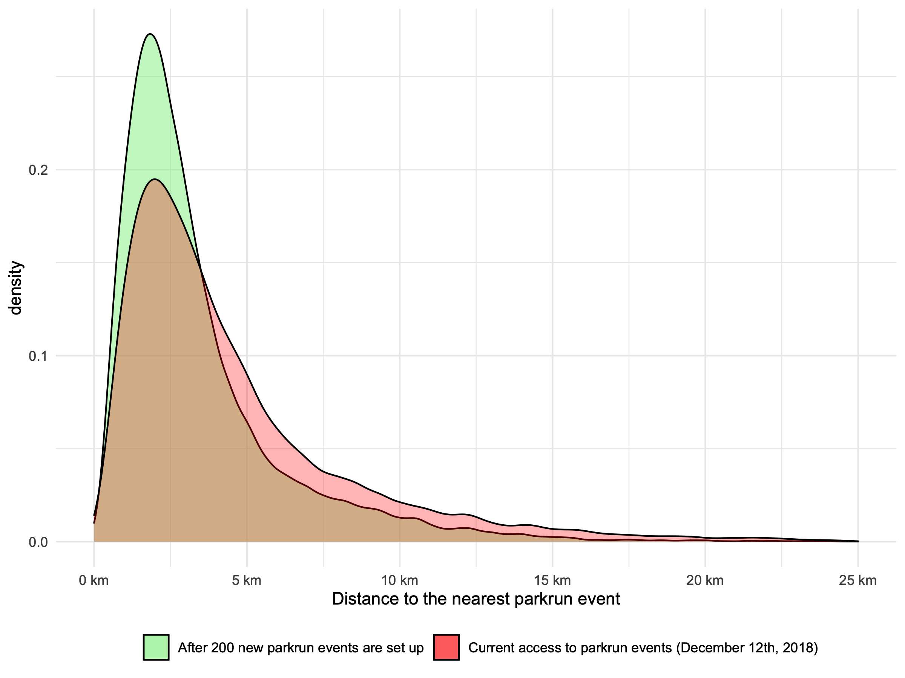

---
output:
  output: pdf_document
bibliography: bibliography.bib
csl: vancouver.csl
---


# Multiple deprivation and geographic distance to community sport events — achieving equitable access to parkrun in England 

  Schneider PP$^{*,1}$, Smith RA$^{1}$, Bullas AM$^{2}$, Quirk H$^{2}$, Bayley T$^{1}$, Haake SSJ$^{2}$, Brennan A$^{1}$, Goyder E$^{1}$ 


*$^{1}$School of Health and Related Research, University of Sheffield, Sheffield, UK.; $^{2}$Advanced Wellbeing Research Centre, Sheffield Hallam University, Sheffield, UK.*


## Introduction

Insufficient physical activity is a leading cause of disease and disability worldwide.[@who2009] For the UK, around one in six deaths is attributable to low levels of physical activity.[@lee2012] It is also a major contributor to health inequalities, as people from low socio-economic background are disproportionately affected by physical inactivity-related diseases. Increasing the physical activity levels of the population is therefore high on the public health agenda: it not only has the potential to improve quality of life, reduce mortality rates and alleviate the strain on health and social care services, but also reduce the gap in health inequalities. 

However, designing effective public health interventions that increase population physical activity is considerable challenge.[@ref] Implementing such interventions in a way that does not increase health inequalities might even be more difficult, as studies have shown that programmes to increase physical activity often fail to reach deprived communities and those most in need.[@white2009; @rideout2018]

parkrun, an international movement which organises free weekly 5km running events, might provide valuable lessons for public health professionals with respect to both. Since its founding in 2004, as a small event in London with 13 participants, it has grown to become one of the world's largest mass sporting events, with up to 360,000 participants in more than 20 countries.[@ref] The volunteer-led running events are often characterised as accessible and inclusive.[@stevinson2015] The organisation has been widely praised as being successful in encouraging participation particularly in individuals who were previously inactive.[@stevinson2004; @wiltshire2018] 

Notwithstanding these subjective accounts, the expansion of parkrun in England, as elsewhere, has been largely driven by *demand*, not *need*. It might therefore be the case that parkrun events are primarily located in areas that are relatively well-off anyway, while people living in more deprived communities may not have the same opportunities to participate. In 2019, Sport England announced funding to support the creation of 200 new parkrun events across England within three years, with the specific aim of increasing participation of individuals from lower socio-economic groups.[@sportengland2018] 

The aims of this study are two-fold: firstly, to evaluate whether geographic access to parkrun events in England is equitable across areas with different levels of deprivation. Secondly, to identify 200 optimal locations for future events, in order to improve geographic access for deprived communities.


## Methods

### Study design

  This study is a cross-sectional ecological analysis of the socio-economic disparities in geographic access to parkrun events in England at the end of 2018. All analyses were conducted on the level of Lower layer Super Output Areas (LSOAs), which divide England into 32,844 geographic units with, on average, a population of approximately 1,700. We assessed the relationship between access, defined as the distance (as the crow flies) to the nearest parkrun event, and socio-economic deprivation, measured using the Index of Multiple Deprivation (IMD). In addition, we used information on green spaces in England to conduct a simple location-allocation analysis in order to identify 200 locations for future parkrun events that maximise access for the English population.


### Data sources

  For this study, we combined data on three types of geospatial entities: 1) LSOAs, 2) parkrun event locations, and 3) public green spaces.

  1) The geographic locations of all 32,844 LSOAs, defined by the coordinates (longitude & latitude) of its population-weighted centroid, 2017 total population estimates, and the 2015 Index of Multiple Deprivation (IMD) were retrieved from the Office for National Statistics [@ons2018; @ref; @ref].

  2) We included all 465 public parkrun events which were in operation in England by December 12th 2018, the date on which Sport England announced their plan to provide funding to set up 200 additional parkrun events across England.[@ref] The coordinates of all 465 events were obtained from the parkrun UK website.[@ref]

  3) The coordinates of 143,822 public green spaces were retrieved from an open Ordnance Survey dataset.[9] parkrun events are held in various settings and terrains, and do not always require a single 5km loop - some events have courses that involve running back and forth. After evaluating existing parkrun event courses, we decided to consider all public parks, gardens, and playing fields in England with an area of 0.1 km$^2$ or more potentially suitable for hosting events (n=2,842). 


### Variables

  Access to parkrun was measured in terms of the distance (as the crow flies) to the nearest event. For each of the 32,844 LSOAs, we computed the geodesic distances (distance as the crow flies) between its population-weighted centroid and all 465 parkrun events and then selected the shortest distance (in km). This distance is the LSOA's distance to the nearest parkrun event - our measure of geographic access.

  The socio-economic deprivation of LSOAs was measured using IMD. It is a measure of relative deprivation, which combines 37 indicators from seven domains (income, employment, education and skills, health and disability, crime, housing and services, and living environment) into a single score. The score ranges from 0 (least deprived) to 100 (most deprived).[@smith2015] 

  Further covariates (e.g. population density or demographics), which are likely to affect the availability of parkrun events, were not taken into account, because we did not aim to assess to what extent deprivation independently 'explains' access. Rather, we sought to evaluate whether or not people living in deprived areas have better or worse access, given all other circumstances.


### Analysis

  Mean, standard deviation, median, interquartile range, and range were used as descriptive statistics. The correlation between IMD and the distance to the nearest parkrun event on the LSOA level were investigated using the Pearson and Spearman method. The correlation coefficients were computed using the LSOAs' total population as weights. A scatter plot with a fitted linear regression model is presented to illustrate the relationship. Our hypothesis was that more deprived areas had worse access, i.e. longer distances to the nearest parkrun event than more affluent areas.

#### Identifying optimal locations for new parkrun events


  We conducted a location-allocation analysis to solve the following problem: parkrun UK received funding to start 200 additional parkrun events. There are 2,842 public green spaces in England in which new events could be set up. Which 200 locations should be selected, in order to maximise access for the English population?

  More specifically, the objective was to minimise the population-weighted total sum of distances between all LSOAs and their nearest parkrun event. To identify the optimal 200 green spaces, we applied a simple greedy algorithm that consisted of two steps. Firstly, for each green space, we evaluate how setting up a parkrun event would affect the sum of distances, given the locations of all existing events (i.e. for how many LSOAs would this green space then be the nearest parkrun event, and by how much an event in this location would decrease the respective distances). Secondly, the green space with the greatest effect is selected and added to the set of existing parkrun events. This procedure is repeated 200 times.

\bigskip

  More formally, the first step of the algorithm is defined by the following equation:

$$\underset{c\in C}{\operatorname{arg min}}\sum_{i=1}^{32,844}{ d_i(E \cap c) * p_{i}}$$

  The function yields the candidate green space $c$, from the set of all 2,842 green spaces $C$, which minimises the sum of the products of the minimum distances and the total population of all LSOAs, whereby $p_i$ denotes the population of LSOA $i$, and $d_i(E \cap c)$ denotes the distance to the nearest parkrun event, which can either be an existing event from the set $E = \{e_{1},e_{2},...,e_{465}\}$, or the candidate green space $c$, whichever is nearest.  

  In order to identify the optimal 200 new locations for setting up new parkrun events, the selection procedure is repeated 200 times. At each step, the single best candidate green space location is selected, added to the set of established parkrun events $E$, and removed from the set of available green spaces $C$. This means, the optimal green space selected at step $k$ is taken into account when selecting the $k$th+1 location.


#### Evaluating the location allocation analysis

  We assessed the overall impact of setting up 200 new parkrun events at the identified optimal location on the geographic access to parkrun events in England. We also conducted a distributional effectiveness analysis, in which we grouped LSOAs into IMD quintiles (most, more, median, less, least deprived) and subsequently assessed how setting up the 200 new events would affect access in each of those subgroups.


### Data and source code availability

  All data and the R source code that were used to generate the results of this study are provided on an open repository.[@ref]


### Ethical approval
  
  Ethical approval was obtained from the Sheffield Hallam University Ethics Committee (ER10776545). We did not collect any personal information, but only used aggregate secondary data. The parkrun Research Board approved this research project, and four of its members (AMB, HQ, EG, SSJH) were actively involved in the interpretation of findings and writing of this manuscript.

## Results

### Descriptive statistics

  As of 12th December 2018, approximately 7%, 69%, and 91% of the English population lived within 1, 5, and 10km of a parkrun event. Only 578,043 people (1% of the English population) lived more than 20km from an event. The average (SD) and median (IQR) distance to the nearest parkrun event were 4.65 (4.22) and 3.39 (1.99-5.83). The worst access was observed for 2,259 people living on the Isles of Scilly, who live about 76.44km (as the crow flies) away from the next parkrun event on the mainland. Further descriptive statistics are provided in table 1.


| **Table 1: Descriptive statistics of LSOAs and parkrun events** |
| ---|---|---|--- |
| <td colspan=4>**LSOA (n =n 32,844) ** |
| ---|---|---|--- |
| |Mean (SD) | Median (Q1-Q3) | Range |
| Population | 1,693.44 (405.35) | 1,612 (1,452-1,834) | 362-13,404 |
| IMD score | 21.67 (15.59) | 17.40 (9.65-30.07) | 0.48-92.60 |
| Distance to the nearest parkrun event location | 4.65 (4.22) | 3.39 (1.99-5.83) | 0.04-76.44 |
|
| <td colspan=4>**Parkrun Events (n = 465)** |
| ---|---|---|--- |
| Served LSOAs\* | 70.63 (42.81) | 62 (40-87) | 6-350 |
| Served population\* | 119,612 (74,290) | 103,952 (68,837-151,488) | 7,855-628,010 |
| ---|---|---|--- |
 | \* Number of LSOAs or population for which a given parkrun event is the nearest. |

### Association between Deprivation and Access

There was a negative relationship between IMD and the distance to the nearest parkrun event: the (population weighted) Pearson and Spearman correlation coefficients were -0.15 and -0.18, indicating a small negative correlation between deprivation and access. This means that on 12th December 2018, those living in more deprived LSOAs tended to have shorter geographic distances to their nearest parkrun event, i.e. better access, than those living in less deprived areas. 

The distributional analysis of distances by IMD quintile showed that people living in the 20% most deprived LSOAs had the best geographic access, with an average and median distance to the nearest parkrun event of 3.51 and 2.79 km. Depending on the metric, the worst access was observed for LSOAs in the middle (mean distance = 3.36km) or the less deprived group (median distance = 3.93km). Further results of the distributional analysis are shown in Table 2 in the following section. 


### Optimal locations for new parkrun events

Figure 1 shows the parkrun events (black circles) that existed on 12th December 2018 alongside recommendations for 200 additional event locations (red triangles), which maximise overall access to parkrun for the English population. The numbers correspond to the rank, where 1 is the location which would improve access the most. The names and geographic coordinates of the selected 200 green spaces are provided in the appendix.


**Figure 1: Map of England showing current parkrun events (blue circles) and recommended new event locations (red triangles) ranked in descending order of estimated effect on overall population-weighted access. Information on all 200 identified optimal green space locations is provided in the appendix.**

We estimate that setting up new parkrun events in those 200 green spaces would improve access for around 16.5 million people (30% of the population) from 9,854 LSOAs. For these areas, the distance to the nearest event would, on average, be reduced by 4.09 km (SD = 3.97). The percentage of people who live within 5km of a parkrun would increase from 69% to 81.9%.

Table 2 shows the difference in geographic access before and after the introduction of the 200 new parkrun events at the identified optimal green spaces. Results are presented for the overall effect and stratified by IMD quintiles. The 200 new events amplified the relationship between IMD and geographic access further: the population-weighted Pearson and Spearman correlation coefficients changed from -0.15 and -0.18 before, to -0.20 and -0.23 afterwards. Nevertheless, the improvement in access was smallest for LSOAs in the most deprived quantile.

Figure 2 shows the distribution of the nearest distances between LSOAs and parkrun events before and after the introduction of the 200 new optimal event locations.


**Figure 2: Density plot of access to parkrun events before and after the creation of 200 new events**

```{r}
# Table 2
# quantile(lsoa_sp$imd_sc,seq(0,1,0.2))
# cbind(mndst_tbl,mndst_new_tbl)
```


## Discussion

Overall, geographic access to parkrun in England is good. On 12th December 2018 more than two thirds of the population lived within 5km (the parkrun distance) of a parkrun event. Contrary to our expectation, we did not find that access was better for people living in more affluent areas. In fact, those living in the most deprived areas had the best geographic access to parkrun.

Our analysis has shown that setting up 200 new events in the optimal green spaces in England would increase the percentage of English residents who live within 5k of a parkrun to 82%. This would increase the inequity in access to parkrun events, improving the geographic access of the most deprived more than the access of those living in more affluent areas. It is rare in public health for inequity to exist in this direction.

While our analysis has not been concerned with confounding factors, we are interested only in geographic access based on multiple deprivation, an explanation for the negative relationship between IMD and access is population density. Since deprived areas cluster in cities, geographical access as the crow flies tends to be better for these areas in part because population density is itself a predictor of the existence of parkrun events.

There are several strengths of this study, it is the first study of geographic access to parkrun in England - therefore the approach is novel and the data untapped. Secondly the analysis makes use of large and rich datasets, with over 30,000 LSOA and over 400 existing parkrun events it is unlikely that individual outliers are affecting the results.
However, there are also limitations. Most importantly geographic access is not travel distance, or travel time. In some cases, for example where natural barriers like lakes or rivers block routes, the actual distance travelled may be far in excess of the distance as the crow flies. Also, in rural areas where car use is more prevalent travel time may be shorter, despite travel distances being longer. Further investigation could determine how perceptions of access change with distance in different settings (e.g. rural vs urban).

The choice of 0.1sq-km for greenspaces may also surprise some readers. However, several parkruns exist in very small areas (Mile End park in London, and Cudmore Grove park in Essex are 0.14sq-km and 0.12sq-km respectively). We therefore chose to maximize sensitivity, at the likely expense of specificity, and therefore it is possible that some of the recommendations are in parks that are not suitable to host a parkrun event. Conversely, many blue spaces such as beaches and promenades are not included in the database and therefore there may exist some locations which we have missed, particularly in coastal areas.

The main finding, that geographical access to parkrun events is better in more deprived communities, is surprising given that we know that participation in parkrun has a strong socioeconomic gradient with higher participation rates in more affluent areas [@smithschneider]. This suggests that providing the opportunity to participate in parkrun events, while a necessary first step to enable participation, has not been enough to engage deprived communities and reduce inequity.

Investigating other barriers to participation in parkrun is likely to improve our understanding of the reasons why physical activity levels are lower in more deprived areas in general, and give parkrun the information it needs to develop strategies, other than improving access, to engage those who live in deprived communities. Future research should build on this work and develop a model to assess the (cost-)effectiveness of setting up new events, and other strategies, not only in terms of improved potential access, but actual participation. This requires estimating the causal and marginal effects of different interventions on participation, and therefore physical activity levels, using longitudinal data and sophisticated modelling techniques.

parkrun has been hugely successful in encouraging physical activity worldwide, it will achieve its vision of a 'healthier, happier planet' [@parkrun2017], but the extent of its impact will be dependent on how well it is able to understand the drivers of participation and develop strategies to overcome the hurdles it identifies.

## Conclusion

Geographic access to parkrun is good, but can be improved considerably with the creation of 200 new events. Surprisingly, we find that geographic access is better for those living in more deprived communities. Given that we know participation rates are much lower in deprived areas, it seems likely that improving access alone is unlikely to significantly reduce inequity in participation. A deeper understanding is needed of the barriers to participation in deprived communities if strategies are going to be created to improve engagement. 

